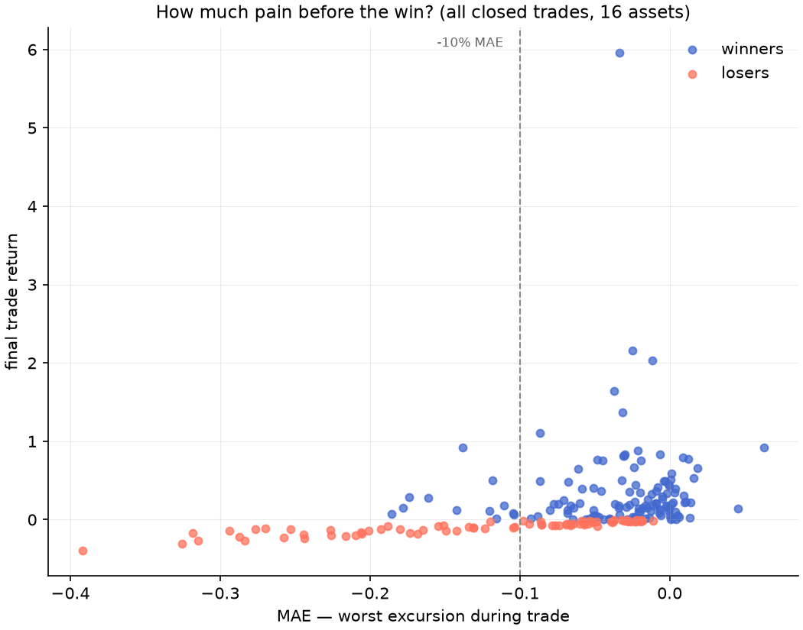

# Phase 10 — Drawdown Survival (MAE / MFE)

206 closed trades across 16 assets, baseline system.

## Pain before gain

- Winners' MAE: median -2.3%, 75th pct -5.1%, worst -18.6%
- Winners that first went >5% underwater: 27%
- Winners that first went >10% underwater: 9%
- Losers' MFE: median 2.4% (they were green first — exits matter)
- MAE worse than -10% still ended positive: 24% of such trades

## Losing streaks (per asset, consecutive losing trades)

|             |   max_consecutive_losses |
|:------------|-------------------------:|
| GBPUSD      |                        6 |
| GOLD        |                        4 |
| OIL         |                        3 |
| DIA         |                        3 |
| USDJPY      |                        3 |
| SP500       |                        2 |
| IWM         |                        2 |
| QQQ         |                        2 |
| NAS100      |                        2 |
| EURUSD      |                        2 |
| SILVER      |                        1 |
| SPY         |                        1 |
| TECH        |                        1 |
| UTILITIES   |                        1 |
| INDUSTRIALS |                        1 |
| MATERIALS   |                        1 |

## Portfolio E underwater profile (vol-targeted, common window)

- Max drawdown: -12.2%
- Weeks underwater (dd<0): 82% of all weeks
- Weeks below -5%: 17%; below -10%: 0%
- Longest underwater spell: 124 weeks

## Implications for risk limits (Phase 11)
- Trade-level stops tighter than ~10% MAE would kill a large share of eventual winners.
- Risk must be managed at the **portfolio** level (sizing + diversification), not per trade.
- Expect 3-6 consecutive losing trades per asset; size so that streak stays inside the buffer.
