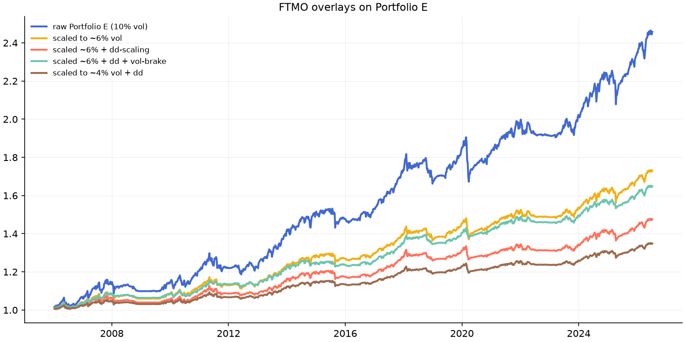

# Phase 11 — FTMO Adaptation

Base: Portfolio E. Overlays: exposure scaling, drawdown-linear cut (flat at -8%),
8-week realized-vol brake. Weekly system: daily-loss risk is bounded by weekly tails shown.

|                             |      cagr |   sharpe |     max_dd |   calmar |   worst_week |   pct_weeks<-2% | ftmo_pass(dd<10%)   |
|:----------------------------|----------:|---------:|-----------:|---------:|-------------:|----------------:|:--------------------|
| raw Portfolio E (10% vol)   | 0.0447712 | 0.7647   | -0.122186  | 0.366419 |   -0.0505123 |      0.0168539  | no                  |
| scaled to ~6% vol           | 0.0270731 | 0.7647   | -0.0746934 | 0.362457 |   -0.0303074 |      0.00655431 | YES                 |
| scaled ~6% + dd-scaling     | 0.0191333 | 0.657665 | -0.0531125 | 0.36024  |   -0.02657   |      0.00374532 | YES                 |
| scaled ~6% + dd + vol-brake | 0.0246599 | 0.935751 | -0.0364017 | 0.67744  |   -0.0131302 |      0          | YES                 |
| scaled to ~4% vol + dd      | 0.0146877 | 0.70415  | -0.0399753 | 0.36742  |   -0.0186026 |      0          | YES                 |

Notes:
- The dd-scaling overlay guarantees exposure hits 0 before the FTMO 10% total-loss line.
- Daily 5% loss limit: portfolio vol ~6%/yr => weekly sigma ~0.8%; a 5% daily move at
  these exposures is a >5-sigma event; per-asset caps (1x) bound gap risk.
