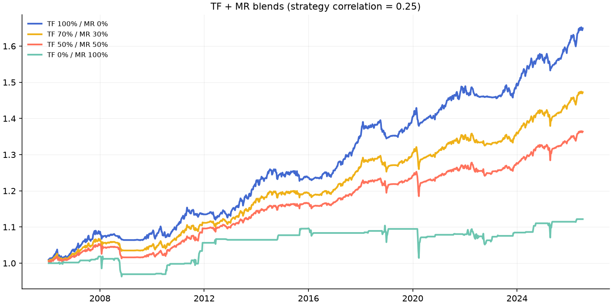

# Phase 13 — Trend Following + Mean Reversion

TF = FTMO-configured trend portfolio. MR = weekly panic-dip sleeve on 8
equity indices, vol-matched to TF. **Correlation TF vs MR: 0.25**

|                 |   sharpe |   cagr |   max_dd |   calmar |
|:----------------|---------:|-------:|---------:|---------:|
| TF 100% / MR 0% |     0.94 |   0.02 |    -0.04 |     0.68 |
| TF 80% / MR 20% |     0.91 |   0.02 |    -0.04 |     0.49 |
| TF 70% / MR 30% |     0.87 |   0.02 |    -0.05 |     0.41 |
| TF 60% / MR 40% |     0.81 |   0.02 |    -0.05 |     0.34 |
| TF 50% / MR 50% |     0.73 |   0.02 |    -0.05 |     0.28 |
| TF 30% / MR 70% |     0.53 |   0.01 |    -0.06 |     0.18 |
| TF 0% / MR 100% |     0.22 |   0.01 |    -0.08 |     0.07 |

