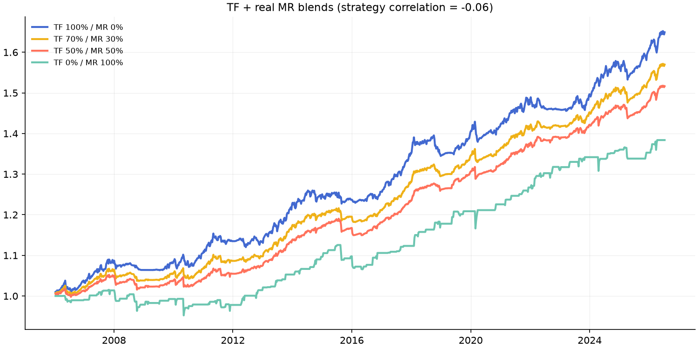

# Phase 13b — Trend Following + real Mean Reversion sleeve

TF = FTMO-configured trend portfolio (same as phase13). MR = MR_QQQ + MR_SPY
from the Mean-Reversion-Research program (Sharpe 0.813 solo, Phase 9 sizing),
daily returns compounded to weekly, vol-matched to TF.
**Correlation TF vs real MR: -0.06**

|                 |   sharpe |   cagr |   max_dd |   calmar |
|:----------------|---------:|-------:|---------:|---------:|
| TF 100% / MR 0% |    0.936 |  0.025 |   -0.036 |    0.677 |
| TF 80% / MR 20% |    1.072 |  0.023 |   -0.027 |    0.843 |
| TF 70% / MR 30% |    1.127 |  0.022 |   -0.028 |    0.782 |
| TF 60% / MR 40% |    1.152 |  0.021 |   -0.032 |    0.677 |
| TF 50% / MR 50% |    1.13  |  0.02  |   -0.035 |    0.589 |
| TF 30% / MR 70% |    0.953 |  0.019 |   -0.042 |    0.449 |
| TF 0% / MR 100% |    0.612 |  0.016 |   -0.062 |    0.257 |

