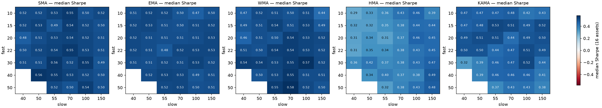

# Phase 3 — Moving Average Study

Grid: fast [10, 15, 20, 22, 30, 40, 50] x slow [40, 50, 55, 70, 100, 150] x ['SMA', 'EMA', 'WMA', 'HMA', 'KAMA'], 16 assets, common warmup 155 weeks, no costs.
Score = **median Sharpe across assets** (robust to one asset dominating).

Book baseline SMA 22/55: median Sharpe **0.54** — beats 90% of all 195 combos tested.

## Stability by MA type

| kind   |   grid_median |   grid_min |   grid_max |   pct_grid_sharpe>0.3 | best   |   best_sharpe |   plateau_mean |
|:-------|--------------:|-----------:|-----------:|----------------------:|:-------|--------------:|---------------:|
| SMA    |          0.52 |       0.48 |       0.56 |                  0.93 | 40/50  |          0.56 |           0.54 |
| EMA    |          0.51 |       0.47 |       0.53 |                  0.93 | 30/100 |          0.53 |           0.52 |
| WMA    |          0.52 |       0.44 |       0.58 |                  0.93 | 50/70  |          0.58 |           0.54 |
| HMA    |          0.38 |       0.29 |       0.49 |                  0.9  | 40/150 |          0.49 |           0.45 |
| KAMA   |          0.47 |       0.32 |       0.53 |                  0.93 | 15/55  |          0.53 |           0.49 |

## Median-Sharpe grids

### SMA

|   fast |     40 |     50 |   55 |   70 |   100 |   150 |
|-------:|-------:|-------:|-----:|-----:|------:|------:|
|     10 |   0.52 |   0.52 | 0.53 | 0.55 |  0.5  |  0.52 |
|     15 |   0.52 |   0.53 | 0.49 | 0.54 |  0.52 |  0.5  |
|     20 |   0.48 |   0.51 | 0.53 | 0.54 |  0.52 |  0.51 |
|     22 |   0.5  |   0.52 | 0.54 | 0.55 |  0.53 |  0.51 |
|     30 |   0.51 |   0.51 | 0.56 | 0.52 |  0.55 |  0.49 |
|     40 | nan    |   0.56 | 0.55 | 0.53 |  0.52 |  0.5  |
|     50 | nan    | nan    | 0.52 | 0.5  |  0.54 |  0.5  |

### EMA

|   fast |     40 |     50 |   55 |   70 |   100 |   150 |
|-------:|-------:|-------:|-----:|-----:|------:|------:|
|     10 |   0.51 |   0.52 | 0.52 | 0.5  |  0.47 |  0.5  |
|     15 |   0.52 |   0.53 | 0.51 | 0.5  |  0.51 |  0.52 |
|     20 |   0.52 |   0.51 | 0.51 | 0.51 |  0.51 |  0.53 |
|     22 |   0.52 |   0.51 | 0.48 | 0.52 |  0.53 |  0.53 |
|     30 |   0.51 |   0.51 | 0.52 | 0.51 |  0.53 |  0.52 |
|     40 | nan    |   0.52 | 0.53 | 0.53 |  0.49 |  0.51 |
|     50 | nan    | nan    | 0.52 | 0.53 |  0.5  |  0.51 |

### WMA

|   fast |     40 |     50 |   55 |   70 |   100 |   150 |
|-------:|-------:|-------:|-----:|-----:|------:|------:|
|     10 |   0.47 |   0.52 | 0.51 | 0.5  |  0.51 |  0.44 |
|     15 |   0.49 |   0.51 | 0.54 | 0.51 |  0.53 |  0.49 |
|     20 |   0.46 |   0.51 | 0.5  | 0.54 |  0.53 |  0.52 |
|     22 |   0.51 |   0.5  | 0.54 | 0.54 |  0.53 |  0.52 |
|     30 |   0.54 |   0.54 | 0.53 | 0.55 |  0.57 |  0.52 |
|     40 | nan    |   0.5  | 0.53 | 0.55 |  0.51 |  0.51 |
|     50 | nan    | nan    | 0.55 | 0.58 |  0.52 |  0.5  |

### HMA

|   fast |     40 |     50 |   55 |   70 |   100 |   150 |
|-------:|-------:|-------:|-----:|-----:|------:|------:|
|     10 |   0.29 |   0.33 | 0.36 | 0.43 |  0.46 |  0.39 |
|     15 |   0.32 |   0.32 | 0.35 | 0.38 |  0.44 |  0.44 |
|     20 |   0.31 |   0.34 | 0.31 | 0.37 |  0.46 |  0.45 |
|     22 |   0.31 |   0.35 | 0.34 | 0.38 |  0.43 |  0.45 |
|     30 |   0.36 |   0.42 | 0.37 | 0.38 |  0.43 |  0.47 |
|     40 | nan    |   0.34 | 0.4  | 0.37 |  0.38 |  0.49 |
|     50 | nan    | nan    | 0.32 | 0.38 |  0.43 |  0.48 |

### KAMA

|   fast |     40 |     50 |   55 |   70 |   100 |   150 |
|-------:|-------:|-------:|-----:|-----:|------:|------:|
|     10 |   0.47 |   0.47 | 0.47 | 0.48 |  0.42 |  0.43 |
|     15 |   0.47 |   0.48 | 0.53 | 0.51 |  0.49 |  0.52 |
|     20 |   0.49 |   0.51 | 0.51 | 0.44 |  0.49 |  0.5  |
|     22 |   0.5  |   0.5  | 0.44 | 0.47 |  0.51 |  0.49 |
|     30 |   0.32 |   0.39 | 0.46 | 0.47 |  0.52 |  0.44 |
|     40 | nan    |   0.39 | 0.46 | 0.46 |  0.46 |  0.41 |
|     50 | nan    | nan    | 0.37 | 0.43 |  0.43 |  0.38 |

## Top 10 combos (do NOT cherry-pick — look at plateaus)

| kind   |   fast |   slow |   median_sharpe |   pct_positive |
|:-------|-------:|-------:|----------------:|---------------:|
| WMA    |     50 |     70 |            0.58 |           0.88 |
| WMA    |     30 |    100 |            0.57 |           0.88 |
| SMA    |     40 |     50 |            0.56 |           0.88 |
| SMA    |     30 |     55 |            0.56 |           0.88 |
| WMA    |     40 |     70 |            0.55 |           0.88 |
| SMA    |     10 |     70 |            0.55 |           0.88 |
| SMA    |     22 |     70 |            0.55 |           0.88 |
| SMA    |     30 |    100 |            0.55 |           0.88 |
| SMA    |     40 |     55 |            0.55 |           0.88 |
| WMA    |     50 |     55 |            0.55 |           0.88 |

