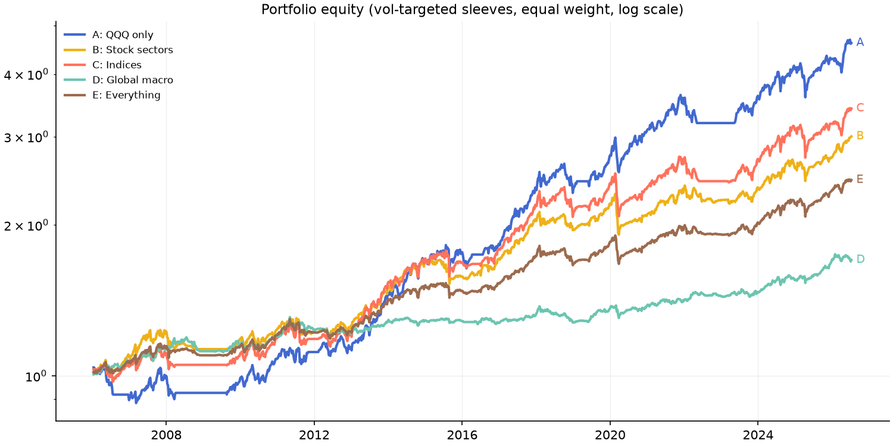

# Phase 6 — Portfolio Construction

Common window 2006-01-13 to 2026-07-10. Sleeves = baseline signal,
EWMA vol target 10%, cap 1x. Equal-weight across sleeves, cash earns 0.

## Portfolio comparison

|                  |   sharpe |   cagr |   max_dd |   calmar |   ann_vol |   avg_pair_corr |
|:-----------------|---------:|-------:|---------:|---------:|----------:|----------------:|
| A: QQQ only      |     0.79 |   0.08 |    -0.15 |     0.51 |      0.1  |            1    |
| B: Stock sectors |     0.71 |   0.06 |    -0.17 |     0.32 |      0.08 |            0.53 |
| C: Indices       |     0.7  |   0.06 |    -0.18 |     0.34 |      0.09 |            0.84 |
| D: Global macro  |     0.65 |   0.03 |    -0.08 |     0.32 |      0.04 |            0.16 |
| E: Everything    |     0.76 |   0.04 |    -0.12 |     0.37 |      0.06 |            0.36 |

## Risk contribution, Portfolio E (equal weight)

|             |   risk_share |
|:------------|-------------:|
| SPY         |        0.098 |
| TECH        |        0.094 |
| DIA         |        0.093 |
| QQQ         |        0.093 |
| NAS100      |        0.092 |
| SP500       |        0.091 |
| INDUSTRIALS |        0.09  |
| IWM         |        0.084 |
| MATERIALS   |        0.08  |
| UTILITIES   |        0.052 |
| SILVER      |        0.037 |
| GOLD        |        0.027 |
| OIL         |        0.022 |
| GBPUSD      |        0.019 |
| EURUSD      |        0.017 |
| USDJPY      |        0.011 |

## Strategy-return correlation matrix

|             |   SPY |   QQQ |   DIA |   IWM |   NAS100 |   SP500 |   GOLD |   SILVER |   OIL |   EURUSD |   GBPUSD |   USDJPY |   TECH |   UTILITIES |   INDUSTRIALS |   MATERIALS |
|:------------|------:|------:|------:|------:|---------:|--------:|-------:|---------:|------:|---------:|---------:|---------:|-------:|------------:|--------------:|------------:|
| SPY         |  1    |  0.88 |  0.93 |  0.83 |     0.88 |    0.95 |   0.09 |     0.23 |  0.16 |     0.15 |     0.22 |     0.17 |   0.87 |        0.43 |          0.87 |        0.72 |
| QQQ         |  0.88 |  1    |  0.77 |  0.72 |     1    |    0.85 |   0.07 |     0.17 |  0.13 |     0.13 |     0.15 |     0.15 |   0.95 |        0.33 |          0.71 |        0.58 |
| DIA         |  0.93 |  0.77 |  1    |  0.79 |     0.77 |    0.89 |   0.08 |     0.22 |  0.12 |     0.15 |     0.22 |     0.16 |   0.77 |        0.43 |          0.9  |        0.74 |
| IWM         |  0.83 |  0.72 |  0.79 |  1    |     0.72 |    0.8  |   0.11 |     0.22 |  0.15 |     0.12 |     0.21 |     0.13 |   0.68 |        0.33 |          0.78 |        0.7  |
| NAS100      |  0.88 |  1    |  0.77 |  0.72 |     1    |    0.85 |   0.06 |     0.17 |  0.13 |     0.13 |     0.16 |     0.15 |   0.95 |        0.32 |          0.71 |        0.57 |
| SP500       |  0.95 |  0.85 |  0.89 |  0.8  |     0.85 |    1    |   0.1  |     0.23 |  0.16 |     0.14 |     0.23 |     0.16 |   0.84 |        0.41 |          0.83 |        0.69 |
| GOLD        |  0.09 |  0.07 |  0.08 |  0.11 |     0.06 |    0.1  |   1    |     0.61 |  0.19 |     0.29 |     0.29 |    -0.14 |   0.06 |        0.18 |          0.08 |        0.18 |
| SILVER      |  0.23 |  0.17 |  0.22 |  0.22 |     0.17 |    0.23 |   0.61 |     1    |  0.15 |     0.27 |     0.3  |    -0.03 |   0.17 |        0.18 |          0.19 |        0.27 |
| OIL         |  0.16 |  0.13 |  0.12 |  0.15 |     0.13 |    0.16 |   0.19 |     0.15 |  1    |     0.19 |     0.12 |    -0.03 |   0.12 |        0.08 |          0.16 |        0.19 |
| EURUSD      |  0.15 |  0.13 |  0.15 |  0.12 |     0.13 |    0.14 |   0.29 |     0.27 |  0.19 |     1    |     0.46 |    -0.13 |   0.12 |        0.1  |          0.13 |        0.18 |
| GBPUSD      |  0.22 |  0.15 |  0.22 |  0.21 |     0.16 |    0.23 |   0.29 |     0.3  |  0.12 |     0.46 |     1    |    -0.16 |   0.15 |        0.14 |          0.21 |        0.24 |
| USDJPY      |  0.17 |  0.15 |  0.16 |  0.13 |     0.15 |    0.16 |  -0.14 |    -0.03 | -0.03 |    -0.13 |    -0.16 |     1    |   0.15 |       -0.06 |          0.14 |        0.08 |
| TECH        |  0.87 |  0.95 |  0.77 |  0.68 |     0.95 |    0.84 |   0.06 |     0.17 |  0.12 |     0.12 |     0.15 |     0.15 |   1    |        0.33 |          0.72 |        0.58 |
| UTILITIES   |  0.43 |  0.33 |  0.43 |  0.33 |     0.32 |    0.41 |   0.18 |     0.18 |  0.08 |     0.1  |     0.14 |    -0.06 |   0.33 |        1    |          0.39 |        0.38 |
| INDUSTRIALS |  0.87 |  0.71 |  0.9  |  0.78 |     0.71 |    0.83 |   0.08 |     0.19 |  0.16 |     0.13 |     0.21 |     0.14 |   0.72 |        0.39 |          1    |        0.77 |
| MATERIALS   |  0.72 |  0.58 |  0.74 |  0.7  |     0.57 |    0.69 |   0.18 |     0.27 |  0.19 |     0.18 |     0.24 |     0.08 |   0.58 |        0.38 |          0.77 |        1    |

